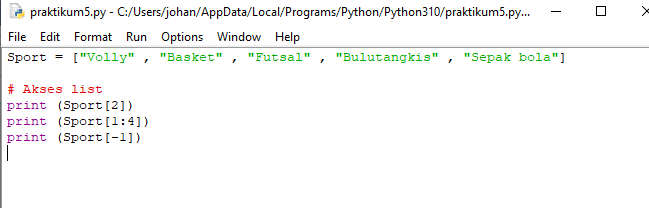
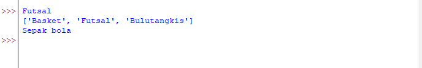
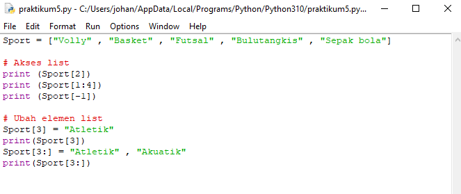
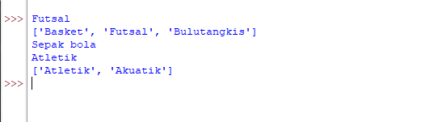
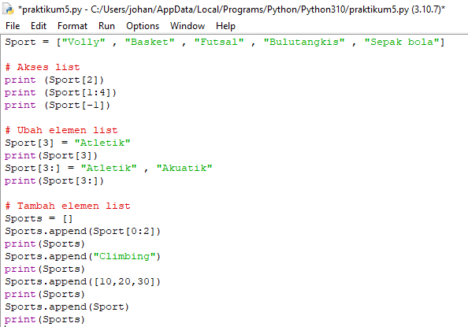

 # Praktikum 5
 ## Latihan

### Buatlah sebuah list sebanyak 5 elemen dengan nilai bebas

### Akses list :
#### - Tampillkan elemen ke 3
#### - Ambil nilai elemen ke 2 sampai elemen ke 4
#### - Ambil elemen terakhir

### Ubah elemen list :
#### - Ubah elemen ke 4 dengan nilai lainnya
#### - Ubah elemen ke 4 sampai dengan elemen terakhir

### Tambah elemen list :
#### - Ambil 2 bagian dari list pertama (A) dan jadikan list ke 2 (B)
#### - Tambah list B dengan nilai string
#### - Tambah list B dengan 3 nilai
#### - Gabungkan list B dengan list A

## Tugas Praktikum

### Buat program sederhana untuk menambahkan data kedalam sebuah list dengan rincian sebagai berikut :

#### - Program meminta memasukkan data sebanyak-banyaknya (gunakan perulangan)
#### - Tampilkan pertanyaam untuk menambahkan data (y/t?), apabila jawaban t (Tidak), maka program akan menampilkan daftar datanya.
#### - Nilai akhir diambil dari perhitungan 3 komponen nilai (Tugas : 30%, UTS : 35%, UAS : 35%)
#### - Buatlah flowchart dan penjelasan programnya pada README.md
#### - Commit dan push repository ke github.

